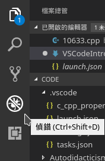
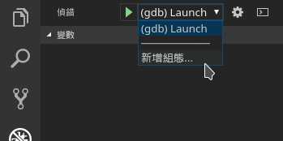
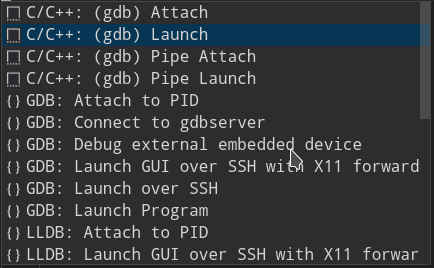

Visual Studio Code 設定流程
===

設定項目：

- build task
- gdb

---

## build task

先按下`Ctrl + Shift + P`後,輸入並執行`Tasks: Configure Default Build Task`，  
就會出現**tasks.json**，用來設定如何**Build**

tasks.json - 2018/05/22

```json
{
    "version": "2.0.0",
    "tasks": [
        {
            "label": "build - g++",
            "type": "shell",
            "command": "g++ ${file} -o ./executable/${fileBasenameNoExtension}",
            "group": {
                "kind": "build",
                "isDefault": true
            },
            "problemMatcher": [
                "$gcc"
            ]
        }
    ]
}
```

> #### Note
> 一開始編譯時，會出現無法找到include檔的狀況，此時，  
> 只要按下被標示紅色波浪線的include旁的燈泡選擇**Add to "includePath": ....**  
> 即會出現一個**c_cpp_properties.json**的檔案來解決問題

## gdb

  
  


launch.json - 2018/05/22

```json
{
    "version": "0.2.0",
    "configurations": [
        {
            "name": "(gdb) Launch",
            "type": "cppdbg",
            "request": "launch",
            "program": "${workspaceRoot}/executable/${fileBasenameNoExtension}",
            "args": [],
            "stopAtEntry": false,
            "cwd": "${workspaceRoot}",
            "environment": [],
            "externalConsole": true,
            "MIMode": "gdb",
            "setupCommands": [
                {
                    "description": "Enable pretty-printing for gdb",
                    "text": "-enable-pretty-printing",
                    "ignoreFailures": true
                }
            ]
        }
    ]
}
```
